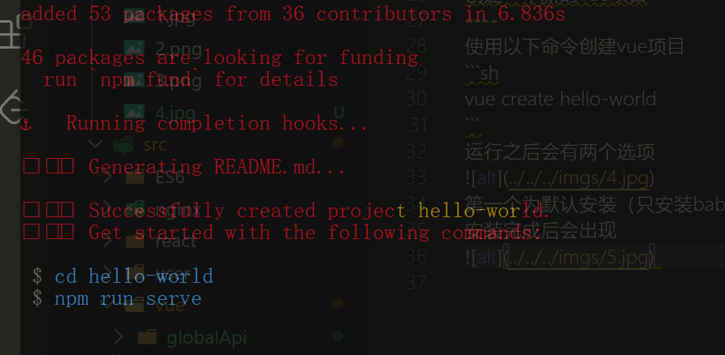

<!--
 * @Description: vue-cli
 * @Author: Mr.yang
 * @Date: 2020-07-21 11:37:02
 * @LastEditTime: 2020-07-21 14:56:39
--> 
安装vue-cli
----
* 1.安装前提  
vue-cli是基于node.js的，想要使用的话，就必须先安装node.js以及npm包管理工具[node](https://nodejs.org/en/)
* 2.安装vue-cli  
在cmd页面执行以下命令
```sh
npm install -g @vue/cli 
```
如果安装了yarn 也可以使用
```sh
yarn global add @vue/cli
```
安装完毕之后使用以下命令查看是否安装成功  
```sh
vue --version  
```
如果出现vue-cli的版本号说明已经安装成功  
  
创建一个新的vue项目
----
使用以下命令创建vue项目  
```sh
vue create hello-world  
```
运行之后会有两个选项
  
第一个为默认安装（只安装babel，eslint）第二个为自定义安装 ，这里选择了默认安装  
安装完成后会出现  
  
照着提示的命令敲一遍出现  
  
复制地址打开浏览器出现  
  
页面，说明第一个vue-cli已创建成功
