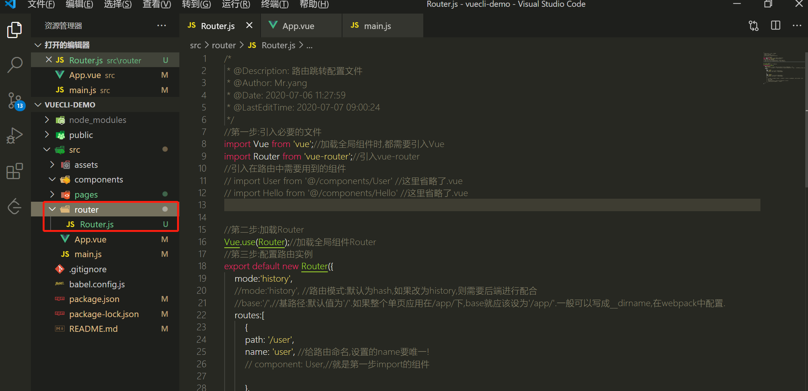

<!--
 * @Description: vue-router
 * @Author: Mr.yang
 * @Date: 2020-07-21 15:18:11
 * @LastEditTime: 2020-07-26 23:26:06
--> 
安装vue-router
----
* 1. 使用以下命令安装  
```sh
npm install vue-router
```
如果在一个模块化(单页面)工程中使用它，必须要通过 Vue.use() 明确地安装路由功能
```javascript
import Vue from 'vue'
import VueRouter from 'vue-router'

Vue.use(VueRouter)  
```
注意：Vue.use()必须在Vue实例化之前调用   

vue-router使用的第一个例子
---
* 1. 本模块的所有代码都是基于vue-cli的默认模式  
 
首先咋们先在/src目录下创建一个router目录，再创建一个router的文件，用来配置路由
  
然后把vue-router引入，并让他加载到vue实例中，这样咋们可以全局使用vue-router了。
```Javascript  
/*
 * @Description: 路由跳转配置文件
 * @Author: Mr.yang
 * @Date: 2020-07-06 11:27:59
 * @LastEditTime: 2020-07-07 09:00:24
 */ 
//第一步:引入必要的文件
import Vue from 'vue';//加载全局组件时,都需要引入Vue
import Router from 'vue-router';//引入vue-router
//引入在路由中需要用到的组件
import User from '@/components/User' //这里省略了.vue
import Hello from '@/components/Hello' //这里省略了.vue


//第二步:加载Router
Vue.use(Router);//加载全局组件Router
//第三步:配置路由实例
export default new Router({
    mode:'history',
	//mode:'history', //路由模式:默认为hash,如果改为history,则需要后端进行配合
	//base:'/',//基路径:默认值为'/'.如果整个单页应用在/app/下,base就应该设为'/app/'.一般可以写成__dirname,在webpack中配置.
	routes:[
        {
		path: '/user', 
		name: 'user', //给路由命名,设置的name要唯一!
        component: User,//就是第一步import的组件
        
        },
        {
		path: '/hello', 
		name: 'hello', //给路由命名,设置的name要唯一!
		component: Hello//就是第一步import的组件
        },
        // {
		// 	//路由懒加载:单页面应用,首页时,加载内容时间过长.运用懒加载对页面组件进行划分,减少首页加载时间
		// 	path:'/Page',
		// 	name:'Page',
		// 	component:resolve => require(['@/components'],resolve)
		// 	//此时component则不需要在第一步import
        // }
    ]
})
``` 
```javascript
<!--
 * @Description: 
 * @Author: Mr.yang
 * @Date: 2020-07-06 11:14:10
 * @LastEditTime: 2020-07-23 15:37:02
--> 
<template>
  <div id="app">
    <button  @click="onClick">跳转User组件</button>
    <button @click="gotoHelllo">跳转Hello组件</button>
      <router-view></router-view>
  </div>
</template>
<script>
//1.先在router/Router.js文件里面配置路由的名称(name)，以及配置映射的组件名称，
//2.通过  this.$router调用push方法可实现路由跳转。
//3.api与H5的history类似
//4.需要使用 <router-view></router-view>标签来渲染路由组件

export default {
  name: 'App',
  components: {
//   index
  },
  methods: {
      onClick:function(){
     this.$router.push('user')
      },
      gotoHelllo:function(){
           this.$router.push('hello')
      }
  }
}
</script>
```  
嵌套路由
---
* 1.在实际项目中，可能需要嵌套多层组件，或者是A页面中含有B页面，此时就需要使用嵌套路由，vue-router给我们提供了嵌套路由的解决方案，即在Router文件中添加children属性
```javascript
        {
		path: '/user', 
		name: 'user', //给路由命名,设置的name要唯一!
        component: User,//就是第一步import的组件
        //user的子路由，需要在children里面配置
        //注意当使用children时，children中的path不能有/，反斜杠
        children:[
            {
                path:'userChild',
                component:UserChild
            }
        ]
        },
 ```
这样配置话，咋们直接在浏览器地址中后面添加/user/userChild就能访问到刚定义的那个组件,并且user页面也会渲染出来